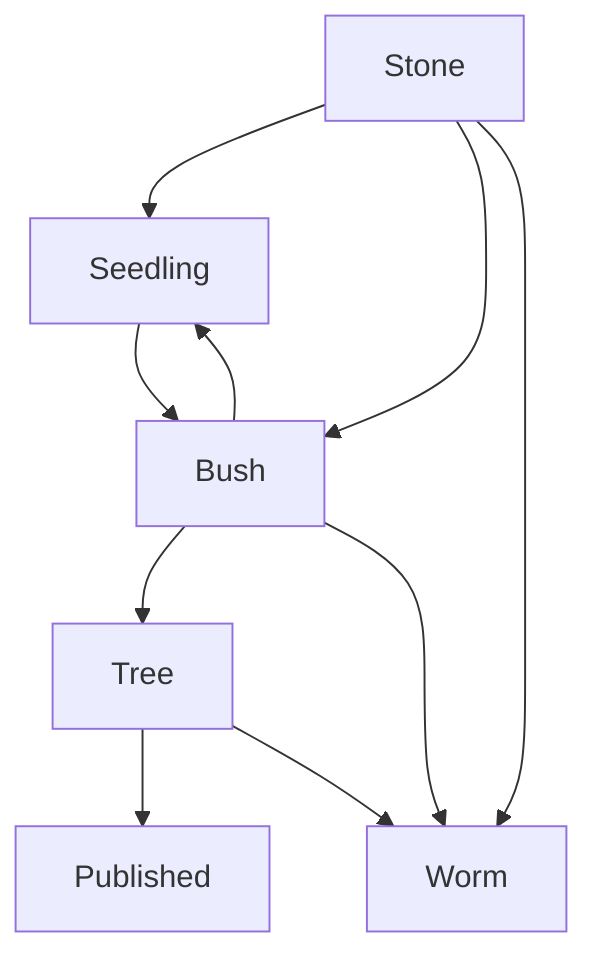

### Status: #🌱 (Incomplete, fledgling)
*(This tag normally goes at the bottom)*

# The Note Workflow

(Insert description)

## Tags
---

Tags indicate the status of a note and distinguishes between garden (ideas, work), library (references, notes), and daily (meetings etc.).

## Daily Notes
---

### #📅
- Daily notes. Perhaps meeting minutes, lecture notes, plans, etc.

## "The Garden"
--- 

### #🪨 
- An idea or piece of work that isn't developed, just jotted down.

### #🌱
- Have engaged with but not refined
- Still adding new material that may or may not be relevant
- A place for free/creative development without worrying about presentation

### #🪴 
- Trimming down, editing
- Thinking about deeply

### #🌲
- Finished working with
- Solidified ideas, publishable

### #🪱
- Given up
- Put in the compost heap

## "The Library"
---

### #🗄 
- Hasn't been read yet
- Still "in the vault" 
- Things want to look at/remember later

### #📖 
- Actively reading, engaging with
- Taking notes on

### #📚 
- Put to the side for now
- Started and have incomplete notes on
- Might pick up later, but maybe not

### #📕
- Finished reading, complete notes.

---
---

# Set Up

## Required Settings:
---

- Files and Links -> Default Location for New Notes
	- Create new notes in folder specified: /Garden
- Core Plugins -> Templates -> Template Folder Location
	- /bin/Templates
	- Don't change date format (YYYY-MM-DD)

## Recommended Plugins:
---

- [Obsidian Git](obsidian://show-plugin?id=obsidian-git)
- [Dataview](obsidian://show-plugin?id=dataview)

## Recommended Hotkeys:
---
- Option + t : Insert template
- Option + d : Open daily note
	- Option + s/f: Open prev/next daily note

 
---
**Status:**
#🌱 

**Contributors:**
[[Aidan Barbieux]]

**Tags:**
[[Meta]], [[Overhead]]

**Links:**

**References:**

Created Date:: 2023-01-24
Created Time:: 19:52
